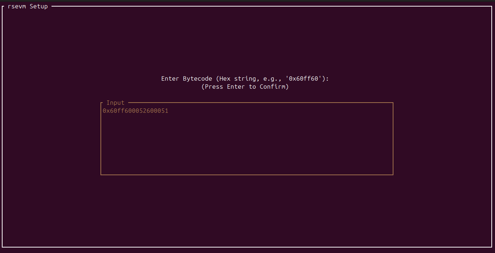

# rsevm: A Modular EVM Implementation in Rust

> A robust, clean-room implementation of the Ethereum Virtual Machine (EVM) built from scratch in Rust, featuring a custom interactive Terminal UI (TUI) debugger.

## Setup Demo

**Initial Setup**


**Bytecode sample selection**


**Bytecode manual writing**


**Gas setup**


## EVM Visual Demo

**EVM Initial State**


**EVM Execution State**


**Success State**


**Failed State**


*(screenshots of rsevm in execution)*

## About The Project

This project is a from-scratch implementation of the Ethereum Virtual Machine, built following the [evm-from-scratch](https://github.com/w1nt3r-eth/evm-from-scratch) curriculum.

While the original guide focuses on passing tests, **rsevm** takes it a step further by focusing on software engineering best practices:
* **Safety:** Full usage of Rust's `Result` types for robust error handling (no `unwrap` in the core loop).
* **Modularity:** Clean separation of concerns between Stack, Memory, Storage, and Opcode logic.
* **Tooling:** A built-in visual debugger to watch the EVM state change in real-time.

It supports most opcodes up to the **Cancun** hardfork.

## Project Structure
```bash
├── src/
│   ├── lib.rs           # Crate root
│   ├── evm.rs           # Main EVM Execution Loop
│   ├── stack.rs         # Stack Data Structure (U256)
│   ├── memory.rs        # Volatile Memory Implementation
│   ├── storage.rs       # Persistent Storage (HashMap)
│   ├── opcodes/         # Modular Opcode Logic
│   │   ├── arithmetic.rs
│   │   ├── bitwise.rs
│   │   └── ...
│   └── bin/
│       └── debug_tui.rs # The Interactive Debugger (Ratatui)
└── tests/               # Integration Tests
```

## Key Features

### Core EVM Architecture
* **Stack Machine:** Fully compliant 256-bit stack handling.
* **Volatile Memory:** Byte-addressable memory with proper expansion gas costs.
* **Persistent Storage:** `SSTORE` and `SLOAD` implementation for contract state.
* **Gas Metering:** Accurate tracking of gas usage per opcode.

### Interactive TUI Debugger
Built with `ratatui` and `crossterm`, the debugger allows you to step through bytecode instruction-by-instruction.
* **Bytecode Pane:** Auto-scrolling view of instructions with current PC highlighting.
* **Memory Viewer:** 16-byte row hex dump to visualize memory expansion.
* **Stack Visualizer:** Real-time view of stack items (Top-down).
* **Status Dashboard:** Live tracking of Gas Used, Program Counter (Hex/Dec), and execution status.
* **Error Modals:** Graceful handling of `OutOfGas`, `StackOverflow`, `StackUnderflow`, and other runtime errors.

### Supported Opcodes
Check `src/opcodes/opcodes.rs` for supported opcodes. This project supports EVM opcodes up to the Cancun Hardfork

## Installation & Usage

### Prerequisites
* Rust & Cargo (Latest Stable)

### 1. Clone the Repository
```bash
git clone https://github.com/youngancient/rsevm.git
cd rsevm
```

### 2. Run the Visual Debugger
To run the TUI with the default bytecode program:
```bash
cargo run --bin debug_tui
```
Note: Expand your terminal for the best experience (avoid truncation)

Controls:

n: Step forward (Execute next opcode)

q: Quit the debugger

### 3. Run the Test Suite
The project includes a comprehensive integration test suite for individual opcodes and state logic.
```bash
cargo test
```

## Contribution

Contributions are welcome! The goal of **rsevm** is to be a robust educational tool that helps learners visualize and understand EVM bytecode execution.

There are two primary ways you can contribute:

### 1. Reporting Issues
If you encounter unexpected behavior or bugs, please raise an issue.
* **Bugs:** If the stack, memory, or storage isn't behaving as expected, let us know.
* **Missing Opcodes:** This project supports opcodes up to the **Cancun** hardfork, but not all logic has been fully implemented yet. If you try to run bytecode and encounter an `Unknown Opcode` error, please open an issue specifying which opcode is missing.

### 2. submitting Pull Requests
Feel free to get your hands dirty and improve the codebase!
1. **Fork** the repository.
2. Create a new branch for your feature or fix.
3. Implement the missing opcode or fix the bug (don't forget to add tests!).
4. Submit a **Pull Request** detailing your changes.

## Acknowledgements

[evm-from-scratch](https://www.evm-from-scratch.app/content/01_intro.html) for the learning roadmap.

[alloy-primitives](https://docs.rs/alloy-primitives/latest/alloy_primitives/) for Rust Ethereum types.

[ratatui](https://ratatui.rs/) for the TUI framework.